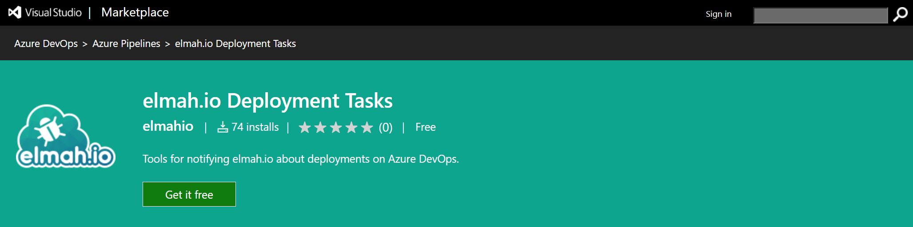
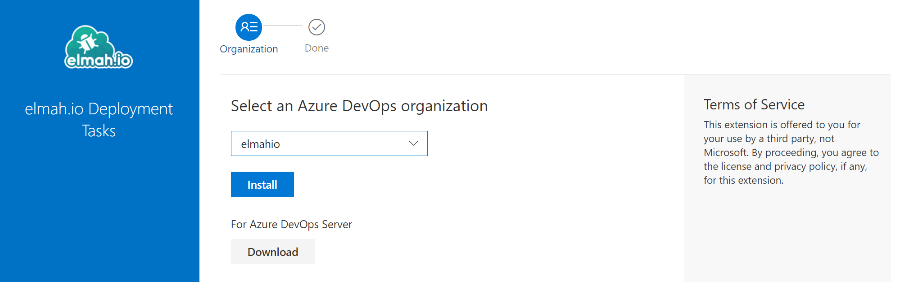
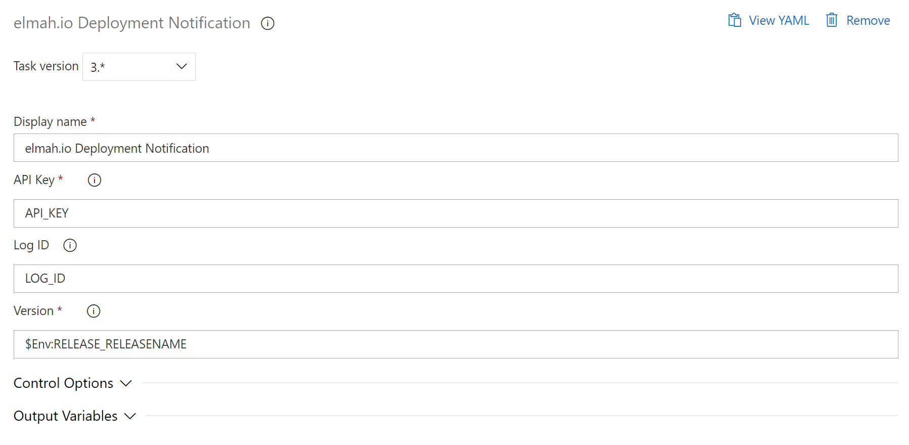

# Notify elmah.io when you deploy

This extension notifies [elmah.io](https://elmah.io) each time your create a new deployment from Azure DevOps. By telling elmah.io about your software versions, you will be able to track how your deployments are performing, in terms of the number of warnings and errors generated by each release.

## Usage

1. Go to the [elmah.io Deployment Tasks](https://marketplace.visualstudio.com/items?itemName=elmahio.deploy-tasks) extension on the Azure DevOps Marketplace and click the _Get it free_ button:

2. Select your organization and click the *Install* button:

3. Go to your Azure DevOps project and add the *elmah.io Deployment Notification* task. Fill in all fields as shown here:

You will need to replace `API_KEY` with an API key ([Where is my API key?](https://docs.elmah.io/where-is-my-api-key/)) with permission ([How to configure API key permissions](https://docs.elmah.io/how-to-configure-api-key-permissions/)) to create deployments. If the deployment is specific to a single log, insert a log ID ([Where is my log ID?](https://docs.elmah.io/where-is-my-log-id/)) with the ID of the log instead of `LOG_ID`. Deployments without a log ID, will show on all logs in the organization.

That's it! Azure DevOps will now notify elmah.io every time the release pipeline is executed.
