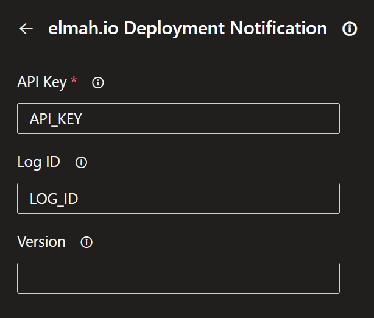

# Notify elmah.io when you deploy

This extension notifies [elmah.io](https://elmah.io) when you create a new build or deployment from Azure DevOps. By telling elmah.io about your software versions, you can track how your deployments are performing, in terms of the number of warnings and errors generated by each release.

## Usage

Go to the [elmah.io Deployment Tasks](https://marketplace.visualstudio.com/items?itemName=elmahio.deploy-tasks) extension on the Azure DevOps Marketplace and click the _Get it free_ button:

Select your organization and click the *Install* button:

The task supports both Pipelines and Releases. No matter which approach you choose, you will need to replace `API_KEY` with an API key ([Where is my API key?](https://docs.elmah.io/where-is-my-api-key/)) with permission ([How to configure API key permissions](https://docs.elmah.io/how-to-configure-api-key-permissions/)) to create deployments. If the deployment is specific to a single log, insert a log ID ([Where is my log ID?](https://docs.elmah.io/where-is-my-log-id/)) with the ID of the log instead of `LOG_ID`. Deployments without a log ID will show on all logs in the organization.

### Pipelines

For Pipelines, edit your pipeline and click the *Show assistant* button. Search for 'elmah.io deploy' and click the *elmah.io Deployment Notification* task:

The task uses the current build number (`BUILD_BUILDNUMBER`) as the version name on elmah.io. If you want to override this behavior, you can insert a value in the *Version* text box.

That's it! Azure DevOps will now notify elmah.io every time the pipeline is executed.

### Releases
For Releases, edit your release pipeline and add the *elmah.io Deployment Notification* task. Fill in all fields as shown here:

The task uses the current release name (`RELEASE_RELEASENAME`) as the version name on elmah.io. If you want to override this behavior, you can insert a value in the *Version* text box.

That's it! Azure DevOps will now notify elmah.io every time the release pipeline is executed.